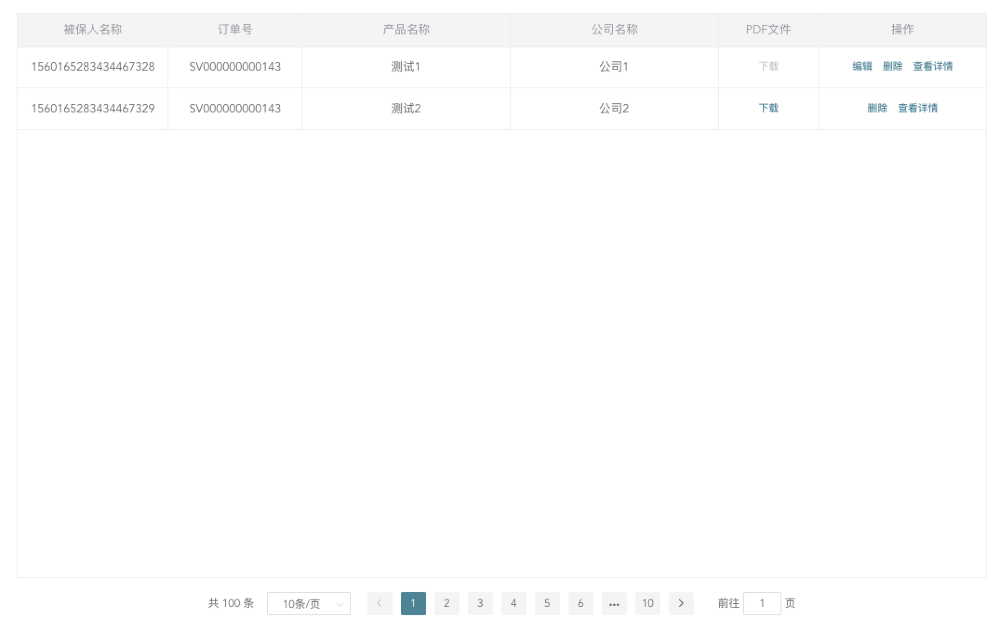

# Table 列表组件

> 用数据结构来展示列表




:::demo

```vue
<template>
  <div class="main-section">
    <div class="main-section-item">
      <ElExTable
        :columnRule="columnRule"
        :tableData="tableData"
        :tableHeight="'calc(100vh - 400px)'"
      />
    </div>
  </div>
</template>
<script>
export default {
  name: 'ElExTableDemo',
  data() {
    return {
      columnRule:[
        {type:'',prop:'id',label:"id",width:'',align:'center'},
        {type:'',prop:'order',label:"保单号",width:'',align:'center'},
        {type:'',prop:'provinceName',label:"省",width:'120',align:'center'},
        {type:'',prop:'cityName',label:"市",width:'120',align:'center'},
        {type:'',prop:'countyName',label:"区",width:'120',align:'center'},
        {
          type:'button',
          prop:'epolicy',
          label:"PDF文件",
          width:'120',
          align:'center',
          fixed:'',
          buttons:[
            {
              name:'下载',
              show:(index, item, data)=>{
                return true
              },
              disabled:(index, item, data)=>{
              },
              function:(index, item, data)=>{
              }
            }
          ]
        },
        {
          type:'button',
          prop:'address',
          label:"操作",
          width:'200',
          align:'center',
          fixed:'right',
          buttons:[
            {
              name: '编辑',
              // 按钮显隐逻辑判断
              show: (index, item, data) => {
                return true
              },
              // 按钮禁用逻辑判断
              disabled: (index, item, data) => {
                return index % 2 == 0 ? true : false
              },
              // 触发自定义方法
              function: (index, item, data) => {
              },
            },
            {
              name: '删除',
              // 按钮显隐逻辑判断
              show: (index, item, data) => {
                return index % 2 == 0 ? true : false
              },
              // 按钮禁用逻辑判断
              disabled: (index, item, data) => {
                return true
              },
              // 触发自定义方法
              function: (index, item, data) => {
              },
            },
            {
              name: '查看详情',
              show: (index, item, data) => {
                return true
              },
              disabled: (index, item, data) => {
                return false
              },
              function:(index, item, data)=>{
                this.toDetail(index, item, data)
              }
            }
          ]
        },
      ],
      tableData: []
    }
  },
  mounted() {
    this.getList()
  },
  methods: {
    async getList(val){
      setTimeout(()=>{
        const objData = {
          code:'0000',
          list:[
            {
                "id":"1561921530181586944",
                "order":"ASDFGHJ8999",
                "name":"李四",
                "provinceCode":"130000000000",
                "cityCode":"130300000000",
                "countyCode":"130303000000",
                "provinceName":"河北省",
                "cityName":"秦皇岛市",
                "countyName":"山海关区",
                "detailAddress":"河北省 / 秦皇岛市 / 山海关区",
            },
            {
                "id":"1561921530181586945",
                "order":"ASDFGHJ9000",
                "name":"李五",
                "provinceCode":"130000000000",
                "cityCode":"130300000000",
                "countyCode":"130303000000",
                "provinceName":"河北省",
                "cityName":"秦皇岛市",
                "countyName":"山海关区",
                "detailAddress":"河北省 / 秦皇岛市 / 山海关区",
            },
          ],
          msg:'成功'
        }
        if(objData.code !== '0000') return;
        this.tableData = objData.list;
      },1000)
    },
    toDetail(index, item, data){
      console.log(index, item, data)
      console.log('跳转详情')
    }
  },
}
</script>

```

:::
