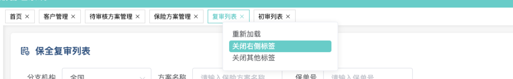

## 业务背景

使用场景中，如果打开一个列表页，再打开一个详情，从详情返回列表，列表页会被重置，希望使用的时候列表和详情独立，且列表页状态不变（分页情况，筛选状态，查询到的数据 ...... ）。


## 菜单功能需求

- 右键打开菜单（重新加载，关闭右侧标签，关闭其他标签）
- 右键打开菜单时点击浏览器其他位置可关闭。
- 标签可以点 x 关闭。
- 所有路由可以配置是否需要缓存。
- 缓存的路由页，标签切换时，一直状态不变。
- 未缓存的路由页，标签切换时，自动重新加载。
- 标签之间可以互相拖动换位置。
- 浏览器刷新标签不发生变化。
- 用户退出，浏览器打开新标签页，菜单的标签重置。

## 完成效果


<!--  -->

## 缺点
> - 现在：重新加载时，需要切换路由再重新打开。达到重新加载的效果。
> - 希望：直接重新重置当前标签内的路由页内容。

## 前端框架

- vue2
- element-ui
- vuex
- vuedraggable（拖拽插件）

## 步骤总纲

1. 路由配置修改。
2. 引入拖拽组件（vuedraggable v2.24.3）。
3. vuex 进行菜单状态管理。
4. 菜单标签组件页逻辑封装。
5. 布局主页逻辑调整。


## 1. 路由配置修改

```javascript
const routes = [
  {
    path: "/",
    redirect: "/login",
  },
  // 登录页面
  {
    path: "/login",
    name: "login",
    component: (resolve) => require(["../views/login/login.vue"], resolve),
  },
  {
    path: "/home",
    redirect:'/homeRole',
    component: (resolve) => require(["../components/Home.vue"], resolve),
    meta: { title: "首页" },
    children: [
      // 首页
      {
        path: "/homeRole",
        name: "homeRole",
        meta: { title: "首页", keepAlive: false }, // title菜单标签的名称 与 keepAlive是否缓存判断
        component: (resolve) => require(["../views/homeModule/homeRole/index.vue"], resolve),
      },
      ...homepage.routes,
      ...caseClaim.routes,
      ...clientManage.routes,
      ...visualization.routes,
      ...conserveManage.routes,
      ...insureScheme.routes,
      ...statisticalManage.routes
    ],
  },
  {
    path: "*",
    name: "404",
    component: resolve => require(["../views/other/404.vue"], resolve)
    }
];

const router = new VueRouter({
  routes,
});

export default router;
```

## 2. 引入拖拽组件（vuedraggable v2.24.3）。

```bash
cnpm install vuedraggablew
```

## 3. vuex 进行菜单状态管理。

```javascript
import Router from '../router/index'

const state = () => ({
  openTabs:[], //所有打开的路由
  activeRouter:"homeRole" //激活状态
});

const getters = {
  getOpenTabs:(state)=> state.openTabs,
  getActiveRouter:(state)=> state.activeRouter,
}

const mutations = {
  setTabs: (state, array) => {
    state.openTabs.splice(0,state.openTabs.length,...array)
  },
  addTabs: (state, data) => {
    state.openTabs.push(data);
  },
  // 删除某个标签
  deleteTabs: (state, index) => {
    let active = '';
    if(state.openTabs.length > 1){
      if(state.activeRouter === state.openTabs[index].name){
        const activeIndex = state.openTabs.length == index + 1 ? index - 1 :index + 1;
        active = state.openTabs[activeIndex];
        state.activeRouter = active.name;
        Router.push({path:active.route})
      }
      state.openTabs.splice(index, 1);
    }else{
      state.openTabs.splice(index, 1);
      Router.push({path:'/homeRole'})
      state.activeRouter = 'homeRole';
    }
  },
  // 删除右侧所有标签
  deleteRightTabs: (state, index) => {
    const len = state.openTabs.length;
    state.openTabs.splice(index + 1, len - index + 1);
    const activeRouter = state.openTabs.find(item=> item.name === state.activeRouter);
    if(!activeRouter){
      state.activeRouter = state.openTabs[index].name;
      Router.push({path:state.openTabs[index].route})
    }
  },
  // 只保留当前选中标签
  deleteOtherTabs: (state, index) => {
    const len = state.openTabs.length;
    const currentRouter = state.openTabs[index];
    state.openTabs.splice(0, len, currentRouter);
    state.activeRouter = state.openTabs[0].name;
    Router.push({path:state.openTabs[0].route})
  },
  // 重新加载当前标签页
  reloadTab: (state, index) => {
    const item = state.openTabs[index];
    if(state.openTabs.length !== 1 ){
      const activeIndex = index === 0 ? index + 1 : index - 1;
      Router.push({path:state.openTabs[activeIndex].route});
      state.openTabs.splice(index,1);
      setTimeout(function() {
        state.openTabs.splice(index,0,item);
        Router.push({path:item.route});
      }, 200);
    }
  },
  setActiveRouter: (state, name) => {
    state.activeRouter = name;
  },
  initTabs: (state, index) => {
    state.openTabs = []
  },
}

const actions = {}

export default {
  namespaced: true,
  state,
  getters,
  mutations,
  actions
}
```

## 4. 菜单标签组件页逻辑封装

```vue
<template>
  <div class="home-tabs section-box">
    <div style="home-tabs-main">
      <Draggable
        class="draggable"
        v-model="routerTabList"
        group="people"
        @start="drag = true"
        @end="drag = false"
      >
        <div
          class="draggable-tabs"
          ref="tabs"
          :class="{'active-tab': activeRouterTab === item.name}"
          v-for="(item, index) in routerTabList"
          :key="index"
          @click="tabClick(item.name)"
          @blur.prevent="hiddenMenu"
          @contextmenu.prevent="showMenu($event)"
        >
          <span class="draggable-tabs-name">{{ routerName(item.name) }}</span>
          <i class="draggable-tabs-delete el-icon-close" v-if="notDelete" @click="tabRemove(item.name,$event)"></i>
        </div>
      </Draggable>

      <el-popover
        placement="bottom"
        width="200"
        trigger="manual"
        v-model="visible"
        :style="styleMenu"
      >
        <div class="menu">
          <div class="menu-item" @click="onMenu(1)">重新加载</div>
          <div class="menu-item" @click="onMenu(2)">关闭右侧标签</div>
          <div class="menu-item" @click="onMenu(3)">关闭其他标签</div>
        </div>
      </el-popover>
    </div>
  </div>
</template>

<script>
import Draggable from 'vuedraggable';
export default {
  name:'HomeTabs',
  components: {
    Draggable
  },
  data() {
    return {
      visible:false,
      activeMenuDom:null,
      styleMenu:'',
      reloadRouterTabName:null, // 重载路由名称
      drag:false,
    };
  },
  watch:{
    '$route'(to,from){
      let flag = false;
      for(let item of this.routerTabList){
        if(item.route === to.path){
          this.$store.commit('router/setActiveRouter',to.name)
          flag = true;
          break;
        }
      }
      if(!flag){
        this.$store.commit('router/addTabs', {
          route: to.path,
          name: to.name,
          title:to.meta.title,
          keepAlive: to.meta.keepAlive || false,
          query:to.query,
          params:to.params,
        });
        this.$store.commit('router/setActiveRouter', to.name);
      }
    }
  },
  computed: {
    notDelete:function(){
      return !(this.routerTabList.length === 1 && this.activeRouterTab === 'homeRole')
    },
    routerTabName:function(){
      if(this.routerTabList && this.routerTabList.length > 1){
        const names = this.routerTabList.map(item => {
          if(!item.hasOwnProperty('keepAlive')) return null;
          if(item.keepAlive){
            return item.name
          }
        });
        return names.filter(item => !!item)
      }else{
        return [];
      }
    },
    routerName:function(){
      const list = this.$store.state.router.openTabs;
      return (name) => {
        const router = list.find(item => item.name === name)
        return router && router.title || name
      }
    },
    routerTabList:{
      get(){
        if(this.$store.state.router && this.$store.state.router.openTabs){
          return this.$store.state.router.openTabs || []
        }else{
          return [];
        }
      },
      set(val){
        this.$store.commit('router/setTabs', val);
      }
    },
    activeRouterTab:{
      get(){
        if(this.$store.state.router && this.$store.state.router.activeRouter){
          return this.$store.state.router.activeRouter;
        }else{
          return "homeRole"
        }
      },
      set(val){
        this.$store.commit('router/setActiveRouter', val);
      }
    }
  },
  created() {
  },
  mounted () {
    // 初始化菜单
    if(this.routerTabList && this.routerTabList.length === 0){
      this.$store.commit('router/addTabs', {route: '/homeRole', name: 'homeRole',title:'首页', keepAlive: false});
      this.$store.commit('router/setActiveRouter', 'homeRole');
    }
    //鼠标按下事件
		document.onmousedown = (event) => {
      if(this.visible == true){
        this.visible = false;
      }
		}
  },
  methods: {
    tabClick(val){
      const item = this.routerTabList.find(item => item.name === val);
      if(item){
        this.$router.push({path:item.route,query:item.query,params:item.params});
      }
    },
    tabRemove(val,e){
      // e.preventDefault();
      e.stopPropagation();
      const index = this.routerTabList.findIndex(item => item.name === val);
      if(index !== -1){
        this.$store.commit('router/deleteTabs',index);
      }
      if(this.routerTabList.length === 0){
        this.$store.commit('router/addTabs', {route: '/homeRole', name: 'homeRole',title:'首页', keepAlive: false});
        this.$store.commit('router/setActiveRouter', 'homeRole');
      }
    },
    async onMenu(val){
      const that = this;
      const index = this.$refs['tabs'].findIndex((item,index)=> item.children[0] === this.activeMenuDom);
      if(index === -1){
        return
      }
      switch (val) {
        // 重新加载
        case 1:
          if(this.routerTabList.length === 1){ return };
          const item = this.routerTabList[index]
          this.reloadRouterTabName = item.name;
          this.$store.commit('router/reloadTab',index);
          break;
        // 关闭右侧标签
        case 2:
          this.$store.commit('router/deleteRightTabs',index);
          break;
        // 关闭其他标签
        case 3:
          this.$store.commit('router/deleteOtherTabs',index);
          break;
      }
    },
    showMenu(e){
      this.activeMenuDom = e.target;
      this.styleMenu = 'position:absolute;left:' + e.layerX + 'px;top:' + e.layerY + 'px;';
      this.visible = true;
    },
    hiddenMenu(){
      this.visible = false
    }
  },
};
</script>

<style lang="scss" scoped>
.home-tabs{
  position: sticky;
  margin-bottom: 0;
  top: 0;
  width: calc(100vw - 200px);
  border-radius:0;
  border: 0;
  z-index: 99;
  min-width: calc(1100px- 200px);
  &-main{
    position: relative;
  }
  .draggable {
    display: flex;
    flex-wrap: wrap;
    &-tabs{
      padding: 4px 8px;
      margin: 4px;
      border: 1px solid #ddd;
      cursor: pointer;
      display: flex;
      align-items: center;
      &-name:hover{
        color: #36cfc9;
      }
      &-delete{
        cursor: pointer;
        margin-left: 4px;
      }
      &-delete:hover{
        color: #36cfc9;
      }
    }
    .active-tab{
      color: #36cfc9;
      border-color: #36cfc9;
    }
    .active-tab i:hover{
      color: #000;
    }
  }
  .menu{
    padding: 0px;
    &-item{
      padding: 2px 6px;
      border-radius: 4px;
      cursor: pointer;
    }
    &-item:hover{
      background-color: #36cfc9;
      color:#fff;
    }
  }
}
</style>

```

## 5. 布局主页逻辑调整

``` vue

<template>
  <el-container>
    <el-header>
      <!-- 头部信息 -->
      <TopHeader @collapse="$refs.Aside.collapse($event)" />
    </el-header>

    <el-container class="main-content">

      <el-aside class="main-content-left">
        <!-- 左侧菜单 -->
        <LeftAside ref="Aside" />
      </el-aside>

      <el-main class="main-content-right">
        <!-- 菜单标签 -->
        <HomeTabs />
        <!-- router-view  -->
        <div class="router-view-content">
          <keep-alive :include="routerTabName">
            <router-view/>
          </keep-alive>
        </div>

      </el-main>

    </el-container>

    <!-- 登录弹窗 -->
    <Login ref="Login" />

  </el-container>
</template>

<script>
import axios from "axios";
import TopHeader from "./Header.vue";
import LeftAside from "./Aside.vue";
import Login from "./Login.vue";
import HomeTabs from '@/components/HomeTabs'

export default {
  components: {
    TopHeader,
    LeftAside,
    Login,
    HomeTabs
  },
  data() {
    return {
    };
  },
  watch:{
  },
  computed: {
    routerTabName:function(){
      if(this.routerTabList && this.routerTabList.length > 1){
        const names = this.routerTabList.map(item => {
          if(!item.hasOwnProperty('keepAlive')) return null;
          if(item.keepAlive){
            return item.name
          }
        });
        return names.filter(item => !!item)
      }else{
        return [];
      }
    },
    routerTabList:{
      get(){
        if(this.$store.state.router && this.$store.state.router.openTabs){
          return this.$store.state.router.openTabs || []
        }else{
          return [];
        }
      }
    },
  },
  created() {
  },
  mounted () {
  },
  methods: {
  },
};
</script>

<style lang="scss" scoped>
.main-content{
  height: calc(100% - 70px) !important;

  &-right{
    overflow: auto
  }

  .router-view-content{
    padding:15px;
  }

}

.el-container {
  height: 100%;
  background-color: #f6f6f6;
}

.el-header {
  height: 42px !important;
  line-height: 42px;
  padding: 0 !important;
  color: #333;
  min-width: 1000px;
}

.el-aside {
  height: 100% !important;
  width: auto !important;
  background-color: #ffffff;
  overflow: hidden;
  box-shadow: 2px 4px 8px 0px #cfcfcf85;
}

.el-main {
  height: 100% !important;
  width: calc(100% - 80px) !important;
  padding: 0px;
}
.el-menu-vertical-demo {
  max-width: 200px !important;
  height: 100%;
  font-weight: normal;
}
.el-menu-vertical-demo:not(.el-menu--collapse) {
  width: 200px;
  min-height: 400px;
}
.el-menu {
  border: 0px;
}
.el-tabs--border-card /deep/ .el-tabs__content{
  padding: 0;
}

.el-main /deep/ .el-tabs__item{
  height: 35px;
  line-height: 35px;
}
.el-main /deep/ .el-tabs--border-card>.el-tabs__header {
  background-color: #f6f6f6;
}
.el-main /deep/ .el-tabs--border-card>.el-tabs__header .el-tabs__item{
  color: rgb(0, 0, 0);
  padding-left: 15px;
  padding-right: 15px;
}
.el-main /deep/ .el-tabs--border-card>.el-tabs__header .el-tabs__item.is-active{
  color:#36cfc9
}
.el-main /deep/ .el-tabs__nav-next, .el-tabs__nav-prev{
  line-height: 36px;
}
</style>

```